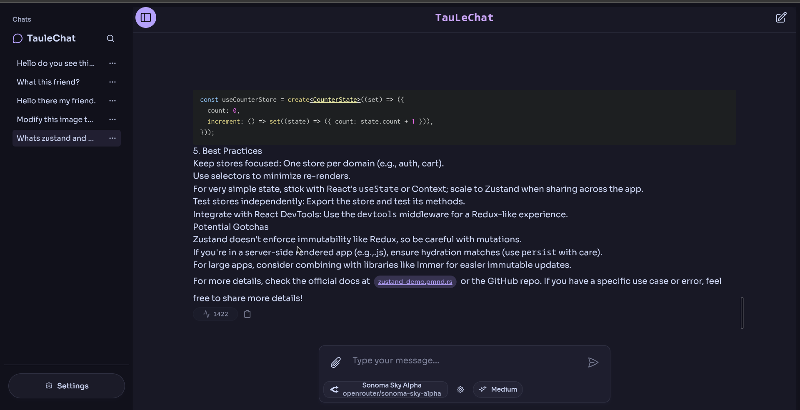

Nice — cleaned, structured, and ready to impress maintainers and humans alike. I tightened the wording, improved hierarchy, added a focused Quick Start, and left clear places for screenshots/badges. Below is a full, ready-to-drop `README.md`. Paste it into your repo, tweak the image paths/badges if you want, and it’ll look sharper.

---

# TauleChat

> A lightweight, desktop-first chat and LLM interface for providers like **OpenRouter** and **Gemini** — clean, fast, and Tauri-ready.

[](https://github.com/aaleccoder/taulechat/actions/workflows/publish.yml)


---

## Table of contents

* [What is TauleChat](#what-is-taulechat)
* [Highlights](#highlights)
* [Screenshots](#screenshots)
* [Quick start](#quick-start)
* [Build from source](#build-from-source)
* [Features](#features)
* [Roadmap](#roadmap)
* [Android & Platform notes](#android--platform-notes)
* [Contributing](#contributing)
* [License](#license)

---

## What is TauleChat

TauleChat is a compact chat interface focused on a fast, desktop-first experience while retaining the ability to build for Android via **Tauri**. It keeps the UI and provider plumbing simple so you can swap or test LLM providers quickly without an unwieldy codebase.

---

## Highlights

* Desktop-first design with mobile/Android support via Tauri.
* Multi-provider LLM support (Gemini, OpenRouter) with streaming and metadata.
* Image support (upload + generation), attachments, and preview/lightbox UI.
* Developer-centric: streaming, SSE buffering for Gemini, thought/collapsible views for debugging model reasoning.

---

## Screenshots

> Replace these with actual screenshots or an animated demo GIF for best effect.




---

## Quick start

Requirements:

* Bun — [https://bun.sh/](https://bun.sh/)
* Rust toolchain (rustup) — [https://rustup.rs/](https://rustup.rs/)

Run locally:

```bash
# install dependencies
bun install

# development mode
bun tauri dev

# build release packages
bun tauri build
```

If you prefer to test only frontend assets:

```bash
bun dev
# (or use your usual frontend dev workflow)
```

---

## Build from source (detailed)

1. Install Bun.
2. Install Rust toolchain via `rustup`.
3. Optional: Android SDK & NDK for Android builds (if targeting Android).
4. Clone the repo and run the commands in [Quick start](#quick-start).

CI tips:

* Cache Bun and Rust toolchains in CI.
* Cache `target/` and Bun cache between runs to speed builds.
* Add platform matrix jobs for macOS, Windows, Linux, and Android.

---

## Features

### Chat & Messaging

* Core chat with LaTeX rendering and syntax-highlighted code blocks.
* Streaming (SSE and provider-specific streaming) with raw-text buffering.
* Collapsible **Thoughts** pane to inspect intermediate model outputs.

### Models & Providers

* Gemini & OpenRouter integration with improved error handling.
* Model picker UI with per-request parameter editor.

### Images & Files

* Upload images and generate images via providers.
* Preview strip and lightbox; optimized loading UX.
* Attach files to messages; Android file handling using `tauri-plugin-fs`.

### UI / UX

* Mobile-friendly ChatInput and ChatMessages components.
* Dialog-based parameter editor and memoized markdown renderer.

### Utilities

* Usage metadata for responses, message stats for Gemini, and link preview tooltips.
* Shell plugin integration and Radix checkbox for multi-select in sidebar.

---

## Roadmap (short-term priorities)

**Release & CI**

* Stabilize publish workflow and release automation.
* Improve CI caching and cross-platform artifacts.

**Provider & streaming**

* Robust SSE/streaming (retries, backpressure).
* Streaming UX: cancel/stop, partial saves.

**Images & local LLMs**

* Better generation controls (presets, params, progress).
* Optional local LLM support groundwork.

**Android & file handling**

* Broader Android tests; finalize `tauri-plugin-fs` behavior across API levels.

**Polishing**

* Add unit/integration tests for providers and message parsing.
* Surface clearer user-facing network/provider errors.

---

## Android & Platform notes

* Android builds require appropriate SDK/NDK and platform tooling. Test file permissions thoroughly across API levels.
* Tauri on Android may require specific `AndroidManifest.xml` permissions for file access (e.g., `READ_EXTERNAL_STORAGE` / `WRITE_EXTERNAL_STORAGE` or SAF usage depending on target API).
* When testing provider streaming on mobile, ensure stable network handling and background/foreground transitions are handled.

---

## Contributing

Not accepting contributions at this time — feel free to fork and explore. If you want to propose changes:

* Create a fork and open a PR against your fork.
* Document workflow changes or CI suggestions in an issue in your fork.

---

## License

MIT License — see [LICENSE](LICENSE).
